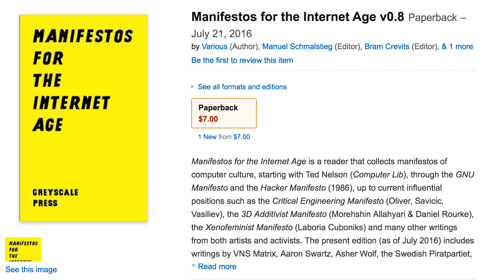

# Manifestos for the Internet Age

A collection of manifestos for the internet age.

The URL of this repository is: [https://github.com/greyscalepress/manifestos](https://github.com/greyscalepress/manifestos)



You can obtain a printed version on [Amazon.com](http://www.amazon.com/Manifestos-Internet-Age-Various/dp/2940561028/), also on [Amazon UK](http://www.amazon.co.uk/Manifestos-Internet-Age-Various/dp/2940561028/), [Germany](http://www.amazon.de/Manifestos-Internet-Age-Various/dp/2940561028/), [France](http://www.amazon.fr/Manifestos-Internet-Age-Various/dp/2940561028/), [Spain](http://www.amazon.es/Manifestos-Internet-Age-Various/dp/2940561028/).

## Format

Same format as other pocket greyscale titles.

Page size: 4.25" x 6.875" (10.795cm x 17.463cm)

Margins, bleed, cover:

See [notes/cover-size.md](notes/cover-size.md)

## Specifications

Description, BISAC Category, ISBN, Pricing...

See [notes/specifications.md](notes/specifications.md)

## Release history

See [content/manifestos/9999-end.txt](content/manifestos/9999-end.txt) 


## Software used

Here is what you need to install in order to compile the book:

### Pandoc

Source: [http://johnmacfarlane.net/pandoc/](http://johnmacfarlane.net/pandoc/)

The package I am using: pandoc-1.14.0.1-osx.pkg

### TeX

Installer for Mac OSX: BasicTeX

[http://www.tug.org/mactex/morepackages.html](http://www.tug.org/mactex/morepackages.html)

The package I am using: basictex-20150613.pkg

### flushend.sty

This is a Latex extension that we use. It needs to be installed.

The method I used to install it: running this in the command line:

```sudo tlmgr install sttools```

### titlesec.sty

Another package we need to install...

Command:    
```sudo tlmgr install titlesec```

The titlesec package allows basic changes to the standard chapter style, including setting the font style and size or placement of the title.

### tocloft.sty

We want to control the Table of Contents: ```\usepackage{tocloft}```

Command:   
```sudo tlmgr install tocloft```


## Troubleshooting

Errors that can occur during compilation:

```! Undefined control sequence.
l.719 \tightlist```

```! Undefined control sequence.
l.4428 \afterpage```

```! LaTeX Error: \chaptermark undefined.```

This error is linked to the fancyhdr package, and is caused by using a document class without the \chapter command (article, scrartcl, ...).    
**Solution:** we need to use the "book" document class

